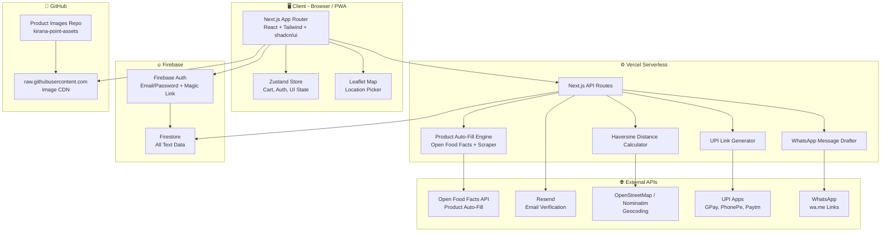
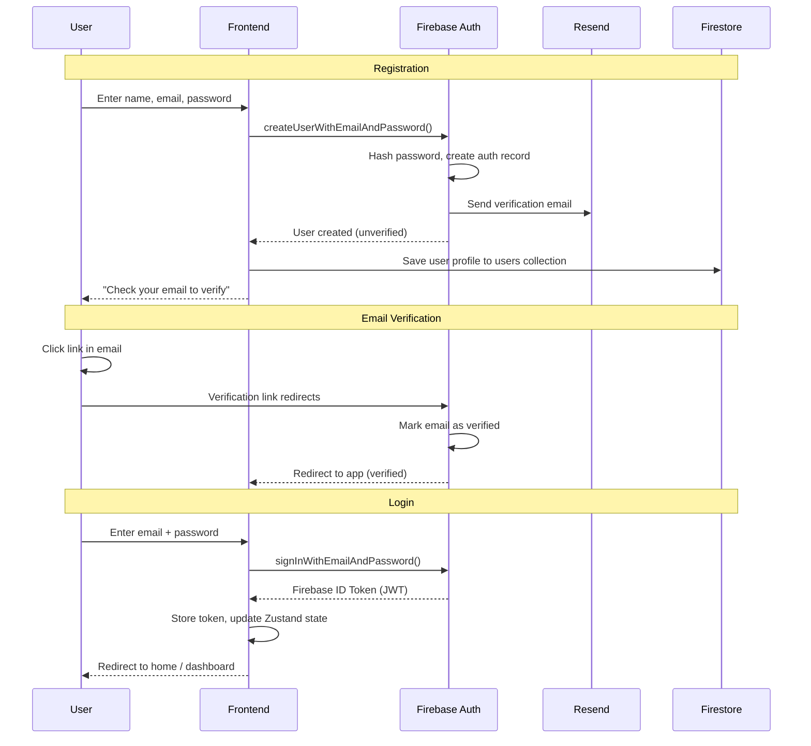
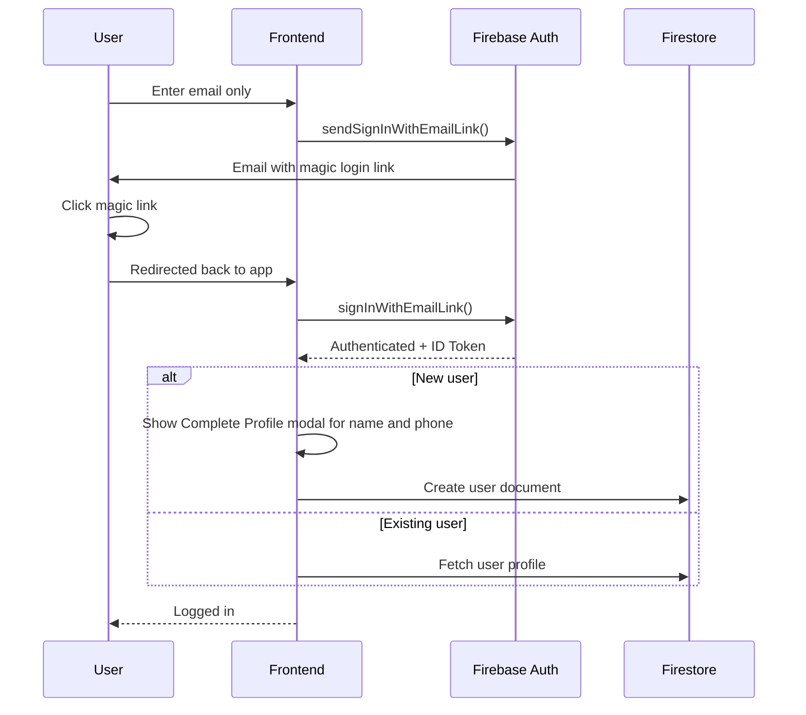
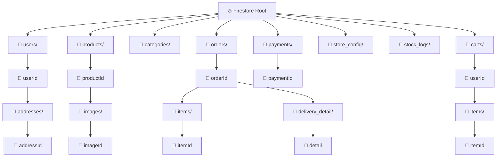
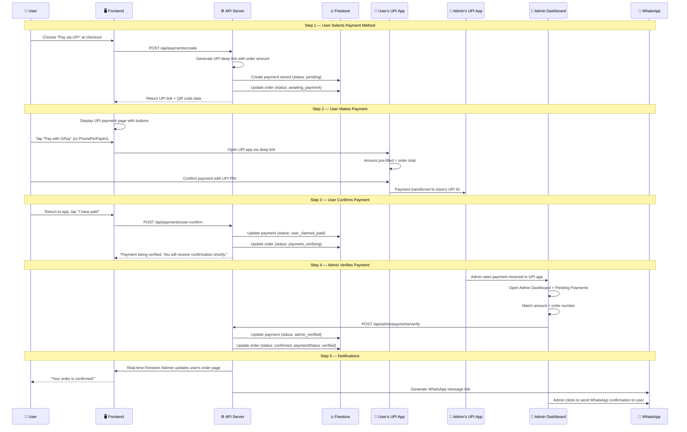
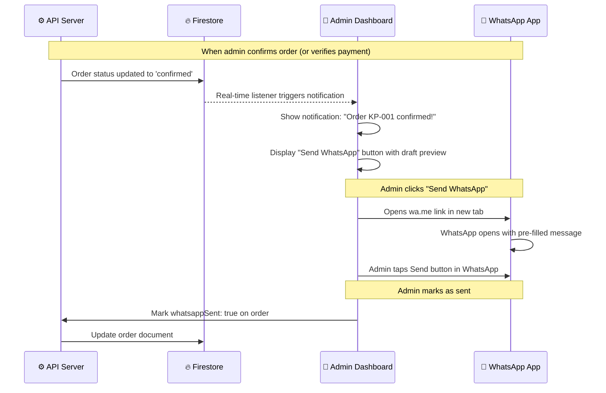
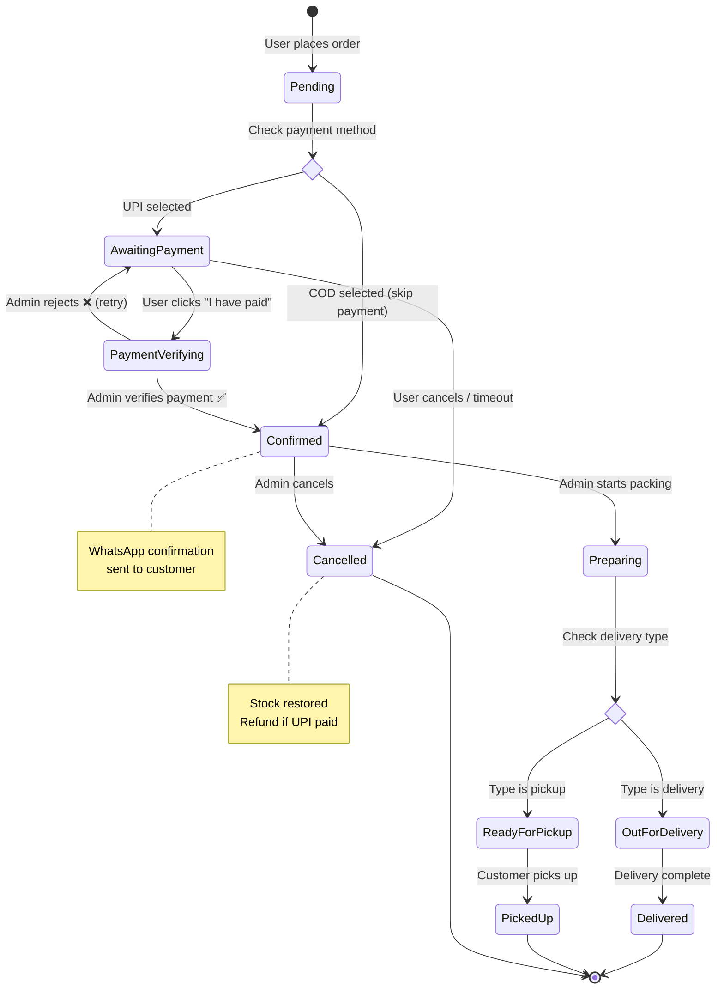
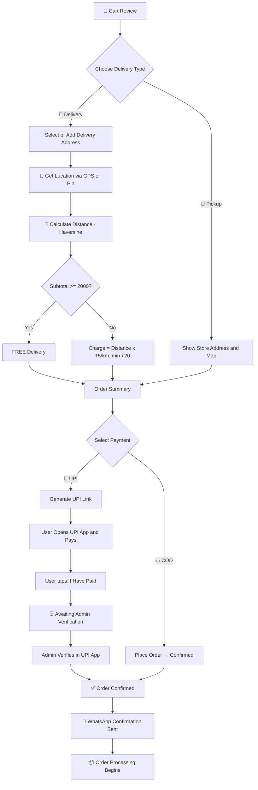

# 🛒 Kirana Point — Web App Development Documentation

> **A professional, production-grade grocery e-commerce platform with email-based authentication, Firebase backend, GitHub-hosted images, UPI payments with admin verification, WhatsApp order notifications, automated product cataloging, and an elegant premium UI.**

---

## 1. Project Overview

| Detail | Value |
|---|---|
| **App Name** | Kirana Point |
| **Tagline** | *"Your neighbourhood store, now online."* |
| **Type** | Full-stack Progressive Web App (PWA) |
| **Target Users** | Local neighbourhood grocery shoppers |
| **Business Model** | Distance-based delivery fee (₹5/km), free delivery above ₹2,000 |
| **Design Philosophy** | Light, soft, elegant, premium — NOT vibe-coded |
| **Payment** | UPI deep link (free, no gateway fees) + Admin manual verification |
| **Notifications** | WhatsApp auto-drafted messages (free via `wa.me` links) |
| **Total Monthly Cost** | **₹0** (completely free at launch) |

---

## 2. Tech Stack (100% Free)

> [!TIP]
> **Every single service below is free** — no credit card, no trial expiry, no hidden costs at launch scale.

### 2.1 Frontend

| Layer | Technology | Free Tier | Why |
|---|---|---|---|
| Framework | **Next.js 14** (App Router) | ∞ | SSR, SEO, API routes, file routing |
| Language | **TypeScript** | ∞ | Type safety across the stack |
| Styling | **Tailwind CSS v4** | ∞ | Utility-first, premium UI |
| Components | **shadcn/ui** | ∞ | Elegant Radix primitives |
| Icons | **Lucide React** | ∞ | Consistent, MIT-licensed |
| State | **Zustand** | ∞ | Lightweight cart/auth state |
| Forms | **React Hook Form + Zod** | ∞ | Validation |
| Maps | **Leaflet + OpenStreetMap** | ∞ | No API key needed |
| Animations | **Framer Motion** | ∞ | Premium micro-interactions |
| PWA | **next-pwa** | ∞ | Installable on mobile |

### 2.2 Backend

| Layer | Technology | Free Tier | Why |
|---|---|---|---|
| Runtime | **Next.js API Routes** | Via Vercel | Serverless, co-located |
| Auth | **Firebase Authentication** | 10K verifications/month | Email/password + Email magic link |
| Database | **Firebase Firestore** | 1GB storage, 50K reads/day, 20K writes/day | NoSQL, real-time, free |
| Image CDN | **GitHub Repository** | Unlimited (public repo) | Version-controlled, tagged, raw CDN |
| Email | **Resend** | 3,000 emails/month | Transactional + verification emails |
| Rate Limiting | **Upstash Redis** | 10K commands/day | Abuse prevention |
| Product Data | **Open Food Facts API** | ∞ | Auto-fill product descriptions |
| Payment | **UPI Deep Links** | ∞ | No gateway fees, direct UPI |
| Notifications | **WhatsApp `wa.me` Links** | ∞ | Free message drafting |

### 2.3 DevOps & Deployment

| Layer | Technology | Free Tier |
|---|---|---|
| Hosting | **Vercel** (Hobby) | 100GB bandwidth |
| CI/CD | **GitHub Actions** | 2,000 min/month |
| Monitoring | **Vercel Analytics** + **Sentry** | Free tiers |
| Domain | `kiranapoint.vercel.app` | Free |

---

## 3. Application Architecture



---

## 4. Authentication System (100% Free — Email Only)

### 4.1 Auth Methods

| Method | How It Works | When to Use |
|---|---|---|
| **Email + Password** | Standard signup → email verification link → login | Primary method |
| **Email Magic Link** | Enter email → receive login link → click to authenticate | Quick, passwordless |

### 4.2 Email + Password Flow



### 4.3 Magic Link (Passwordless) Flow



### 4.4 Security Rules

| Rule | Implementation |
|---|---|
| Password strength | Min 8 chars, 1 uppercase, 1 number (Zod validation) |
| Email verification | Required before placing orders |
| Session management | Firebase ID tokens (1 hour) + refresh tokens |
| Rate limiting | Upstash Redis: max 5 magic links/email/hour |
| CSRF | Built-in with Firebase + Next.js |
| Admin detection | Custom claim `admin: true` on Firebase Auth |

---

## 5. Database Design — Firebase Firestore

### 5.1 Collection Structure



### 5.2 Collection Schemas

#### `users/{userId}`
```typescript
interface User {
  uid: string;                    // Firebase Auth UID
  name: string;
  email: string;
  phone?: string;                 // Collected during checkout for WhatsApp
  role: 'customer' | 'admin' | 'staff';
  isVerified: boolean;
  avatarUrl?: string;
  defaultAddressId?: string;
  totalOrders: number;            // Denormalized
  totalSpent: number;             // Denormalized
  createdAt: Timestamp;
  updatedAt: Timestamp;
}

// Sub-collection: users/{userId}/addresses/{addressId}
interface Address {
  label: 'home' | 'work' | 'other';
  fullAddress: string;
  city: string;
  pincode: string;
  latitude: number;
  longitude: number;
  isDefault: boolean;
  createdAt: Timestamp;
}
```

#### `categories/{categoryId}`
```typescript
interface Category {
  name: string;                   // "Fruits & Vegetables"
  slug: string;                   // "fruits-vegetables"
  iconName: string;               // Lucide icon name: "apple"
  sortOrder: number;
  isActive: boolean;
  productCount: number;           // Denormalized count
  createdAt: Timestamp;
}
```

#### `products/{productId}`
```typescript
interface Product {
  // Core info
  name: string;                   // "Tata Salt"
  slug: string;                   // "tata-salt-1kg"
  sku: string;                    // "KP-SALT-001"
  categoryId: string;
  categoryName: string;           // Denormalized

  // Auto-filled from Open Food Facts
  description: string;
  brand: string;
  barcode?: string;
  ingredients?: string;
  nutritionInfo?: {
    energy?: string;
    protein?: string;
    carbs?: string;
    fat?: string;
    fiber?: string;
  };

  // Pricing
  mrp: number;
  sellingPrice: number;
  discount: number;               // ((mrp - sellingPrice) / mrp) * 100
  priceComparison?: {
    bigbasket?: number;
    blinkit?: number;
    zepto?: number;
    jiomart?: number;
    fetchedAt: Timestamp;
  };

  // Unit
  unit: 'kg' | 'g' | 'L' | 'mL' | 'pcs' | 'pack' | 'dozen';
  unitValue: number;

  // Stock
  stockQuantity: number;
  lowStockThreshold: number;
  isActive: boolean;

  // Images (GitHub paths)
  images: ProductImage[];

  // Search
  tags: string[];
  searchKeywords: string;

  createdAt: Timestamp;
  updatedAt: Timestamp;
  autoFilledAt?: Timestamp;
}

interface ProductImage {
  url: string;                    // GitHub raw URL
  githubPath: string;             // "products/staples/tata-salt-1kg/main.webp"
  altText: string;
  isPrimary: boolean;
  sortOrder: number;
}
```

#### `carts/{userId}/items/{itemId}`
```typescript
interface CartItem {
  productId: string;
  productName: string;
  productImage: string;
  sellingPrice: number;
  quantity: number;
  unit: string;
  unitValue: number;
  addedAt: Timestamp;
  updatedAt: Timestamp;
}
```

#### `orders/{orderId}`
```typescript
interface Order {
  orderNumber: string;            // "KP-20260826-0001"
  userId: string;
  userName: string;
  userEmail: string;
  userPhone: string;              // For WhatsApp notification

  // Status
  status: 'pending' | 'awaiting_payment' | 'payment_verifying' |
          'confirmed' | 'preparing' | 'out_for_delivery' |
          'ready_for_pickup' | 'delivered' | 'picked_up' | 'cancelled';
  statusHistory: {
    status: string;
    changedAt: Timestamp;
    changedBy: string;
    note?: string;
  }[];

  // Delivery
  deliveryType: 'delivery' | 'pickup';
  addressSnapshot?: Address;

  // Pricing
  subtotal: number;
  deliveryCharge: number;
  discount: number;
  total: number;

  // Payment
  paymentMethod: 'cod' | 'upi';
  paymentStatus: 'pending' | 'awaiting_verification' | 'verified' | 'refunded';
  paymentId?: string;             // Reference to payments collection
  upiTransactionRef?: string;     // UPI transaction ID entered by admin

  // WhatsApp notification
  whatsappSent: boolean;
  whatsappSentAt?: Timestamp;

  notes?: string;
  placedAt: Timestamp;
  deliveredAt?: Timestamp;
  createdAt: Timestamp;
  updatedAt: Timestamp;
}

// Sub-collection: orders/{orderId}/items/{itemId}
interface OrderItem {
  productId: string;
  productNameSnapshot: string;
  productImageSnapshot: string;
  priceSnapshot: number;
  quantity: number;
  lineTotal: number;
}

// Sub-collection: orders/{orderId}/delivery_detail/detail
interface DeliveryDetail {
  storeLat: number;
  storeLng: number;
  customerLat: number;
  customerLng: number;
  distanceKm: number;
  chargePerKm: number;
  calculatedCharge: number;
  finalCharge: number;
  isFreeDelivery: boolean;
  freeDeliveryReason?: string;
  estimatedDelivery?: Timestamp;
}
```

#### `payments/{paymentId}` — Payment Tracking
```typescript
interface Payment {
  orderId: string;
  orderNumber: string;
  userId: string;
  userName: string;

  // UPI Details
  method: 'upi' | 'cod';
  upiId: string;                  // Store's UPI ID used
  amount: number;
  upiDeepLink: string;            // The generated upi:// link

  // Verification
  status: 'pending' | 'user_claimed_paid' | 'admin_verified' | 'admin_rejected' | 'refunded';
  userClaimedAt?: Timestamp;      // When user clicked "I have paid"
  adminVerifiedAt?: Timestamp;    // When admin confirmed payment
  adminVerifiedBy?: string;       // Admin UID
  upiTransactionRef?: string;     // UPI ref ID from admin's UPI app
  rejectionReason?: string;       // If admin rejects

  createdAt: Timestamp;
  updatedAt: Timestamp;
}
```

#### `store_config/main` (Singleton)
```typescript
interface StoreConfig {
  storeName: string;              // "Kirana Point"
  storePhone: string;             // Admin's phone for WhatsApp
  storeEmail: string;
  storeAddress: string;
  storeLatitude: number;
  storeLongitude: number;
  deliveryRatePerKm: number;      // 5
  freeDeliveryThreshold: number;  // 2000
  maxDeliveryRadiusKm: number;    // 15
  minOrderAmount: number;         // 100
  operatingHours: string;
  isStoreOpen: boolean;

  // UPI Settings
  upiId: string;                  // "kiranapoint@upi"
  upiDisplayName: string;         // "Kirana Point"

  // WhatsApp Settings
  whatsappNumber: string;         // Admin's WhatsApp number with country code
  whatsappAutoMessage: boolean;   // Enable auto-draft feature

  updatedAt: Timestamp;
}
```

#### `stock_logs/{logId}`
```typescript
interface StockLog {
  productId: string;
  productName: string;
  action: 'order_placed' | 'order_cancelled' | 'restock' | 'adjustment';
  quantityChange: number;
  stockBefore: number;
  stockAfter: number;
  reason: string;
  performedBy: string;
  orderId?: string;
  createdAt: Timestamp;
}
```

### 5.3 Firestore Security Rules
```javascript
rules_version = '2';
service cloud.firestore {
  match /databases/{database}/documents {

    // Users: read/write own profile
    match /users/{userId} {
      allow read: if request.auth != null && request.auth.uid == userId;
      allow write: if request.auth != null && request.auth.uid == userId;
      match /addresses/{addressId} {
        allow read, write: if request.auth != null && request.auth.uid == userId;
      }
    }

    // Products: public read, admin write
    match /products/{productId} {
      allow read: if true;
      allow write: if request.auth != null && request.auth.token.admin == true;
    }

    // Categories: public read, admin write
    match /categories/{categoryId} {
      allow read: if true;
      allow write: if request.auth != null && request.auth.token.admin == true;
    }

    // Cart: per-user
    match /carts/{userId}/{document=**} {
      allow read, write: if request.auth != null && request.auth.uid == userId;
    }

    // Orders: user reads own, admin reads all
    match /orders/{orderId} {
      allow read: if request.auth != null &&
                    (resource.data.userId == request.auth.uid ||
                     request.auth.token.admin == true);
      allow create: if request.auth != null;
      allow update: if request.auth != null &&
                      request.auth.token.admin == true;
      match /{subcoll}/{docId} {
        allow read: if request.auth != null;
        allow write: if request.auth != null;
      }
    }

    // Payments: user reads own, admin reads/writes all
    match /payments/{paymentId} {
      allow read: if request.auth != null &&
                    (resource.data.userId == request.auth.uid ||
                     request.auth.token.admin == true);
      allow create: if request.auth != null;
      allow update: if request.auth != null &&
                      request.auth.token.admin == true;
    }

    // Store config: public read, admin write
    match /store_config/{docId} {
      allow read: if true;
      allow write: if request.auth != null && request.auth.token.admin == true;
    }

    // Stock logs: admin only
    match /stock_logs/{logId} {
      allow read, write: if request.auth != null && request.auth.token.admin == true;
    }
  }
}
```

### 5.4 Firestore Indexes (Composite)

| Collection | Fields | Purpose |
|---|---|---|
| `products` | `categoryId` ASC + `sellingPrice` ASC | Category page sorted by price |
| `products` | `isActive` ASC + `stockQuantity` DESC | Active in-stock products |
| `products` | `categoryId` ASC + `createdAt` DESC | Newest in category |
| `orders` | `userId` ASC + `createdAt` DESC | User's order history |
| `orders` | `status` ASC + `createdAt` DESC | Admin order filtering |
| `orders` | `paymentStatus` ASC + `createdAt` DESC | Payment verification queue |
| `payments` | `status` ASC + `createdAt` DESC | Pending payment queue |
| `stock_logs` | `productId` ASC + `createdAt` DESC | Stock history per product |

---

## 6. UPI Payment System (₹0 Gateway Fees)

### 6.1 Why UPI Deep Links (No Payment Gateway)

| Factor | Razorpay / Cashfree | UPI Deep Links |
|---|---|---|
| **Setup cost** | KYC, business registration | None |
| **Transaction fee** | 0-2% per transaction | **₹0** |
| **Integration** | SDK, webhooks, dashboard | Simple URL generation |
| **Verification** | Automatic webhook | Admin manual verification |
| **Best for** | Large-scale e-commerce | Small stores like Kirana Point |

> [!NOTE]
> UPI deep links open the user's preferred UPI app (GPay, PhonePe, Paytm, etc.) with the amount pre-filled. The payment goes directly to the store owner's UPI ID. Admin verifies receipt manually in their UPI app.

### 6.2 UPI Deep Link Generation

```typescript
// src/lib/upi.ts

interface UPILinkParams {
  upiId: string;          // "kiranapoint@okaxis"
  payeeName: string;      // "Kirana Point"
  amount: number;         // 1500.00
  orderId: string;        // "KP-20260826-0001"
  note: string;           // "Order KP-20260826-0001"
}

export function generateUPIDeepLink(params: UPILinkParams): string {
  const { upiId, payeeName, amount, orderId, note } = params;

  // Standard UPI deep link format (works with all UPI apps)
  const upiLink = new URL('upi://pay');
  upiLink.searchParams.set('pa', upiId);           // Payee Address (UPI ID)
  upiLink.searchParams.set('pn', payeeName);        // Payee Name
  upiLink.searchParams.set('am', amount.toFixed(2)); // Amount
  upiLink.searchParams.set('cu', 'INR');             // Currency
  upiLink.searchParams.set('tn', note);              // Transaction Note
  upiLink.searchParams.set('tr', orderId);           // Transaction Reference

  return upiLink.toString();
}

// Intent-based links for specific apps (fallback)
export function generatePaymentLinks(params: UPILinkParams) {
  const baseLink = generateUPIDeepLink(params);
  const webParams = `pa=${params.upiId}&pn=${encodeURIComponent(params.payeeName)}&am=${params.amount}&cu=INR&tn=${encodeURIComponent(params.note)}`;

  return {
    // Universal UPI deep link (opens default UPI app)
    upi: baseLink,

    // Google Pay specific
    gpay: `tez://upi/pay?${webParams}`,

    // PhonePe specific
    phonepe: `phonepe://pay?${webParams}`,

    // Paytm specific
    paytm: `paytmmp://pay?${webParams}`,

    // Web fallback (for desktop — shows QR code)
    qrData: baseLink,
  };
}

// Example output:
// upi://pay?pa=kiranapoint@okaxis&pn=Kirana+Point&am=1500.00&cu=INR
//   &tn=Order+KP-20260826-0001&tr=KP-20260826-0001
```

### 6.3 Complete Payment Flow



### 6.4 Payment Page UI (User Side)

```
┌──────────────────────────────────────────────────────┐
│                                                      │
│  💳 Complete Payment                                 │
│                                                      │
│  ┌──────────────────────────────────────────────┐    │
│  │  Order: KP-20260826-0001                     │    │
│  │  Amount: ₹1,500.00                           │    │
│  │  Pay to: Kirana Point                        │    │
│  │  UPI ID: kiranapoint@okaxis                  │    │
│  └──────────────────────────────────────────────┘    │
│                                                      │
│  ── Pay using UPI App ───────────────────────────    │
│                                                      │
│  ┌──────────┐ ┌──────────┐ ┌──────────┐            │
│  │  G Pay   │ │ PhonePe  │ │  Paytm   │            │
│  │  [icon]  │ │  [icon]  │ │  [icon]  │            │
│  └──────────┘ └──────────┘ └──────────┘            │
│                                                      │
│  [ 📱 Open Any UPI App ]     ← Generic UPI link     │
│                                                      │
│  ── Or scan QR code ─────────────────────────────    │
│  ┌────────────────┐                                  │
│  │                │                                  │
│  │   [QR Code]    │  ← For desktop users             │
│  │   ₹1,500.00    │                                  │
│  │                │                                  │
│  └────────────────┘                                  │
│                                                      │
│  ── After payment ───────────────────────────────    │
│  ┌──────────────────────────────────────────────┐    │
│  │  ✅ I have completed the payment              │    │
│  └──────────────────────────────────────────────┘    │
│                                                      │
│  ── Or pay later ────────────────────────────────    │
│  [ 💵 Pay Cash on Delivery instead ]                 │
│                                                      │
│  ⓘ Your order will be confirmed once the store      │
│    verifies your payment. This usually takes         │
│    5-10 minutes during operating hours.              │
│                                                      │
└──────────────────────────────────────────────────────┘
```

### 6.5 Payment Verification Page (After "I have paid")

```
┌──────────────────────────────────────────────────────┐
│                                                      │
│  ⏳ Payment Verification                             │
│                                                      │
│  ┌──────────────────────────────────────────────┐    │
│  │                                              │    │
│  │     [Animated clock/spinner icon]            │    │
│  │                                              │    │
│  │  Your payment is being verified              │    │
│  │                                              │    │
│  │  Order: KP-20260826-0001                     │    │
│  │  Amount: ₹1,500.00                           │    │
│  │                                              │    │
│  │  The store owner will verify your payment    │    │
│  │  and confirm your order shortly.             │    │
│  │                                              │    │
│  │  ⏱️ Usually takes 5-10 minutes               │    │
│  │                                              │    │
│  └──────────────────────────────────────────────┘    │
│                                                      │
│  ── Status ──────────────────────────────────────    │
│  ✅ Order Placed                                     │
│  ✅ Payment Sent                                     │
│  🔄 Payment Verification (in progress...)            │  ← Live update
│  ○ Order Confirmed                                   │
│  ○ Preparing Your Order                              │
│                                                      │
│  [ 🏠 Continue Shopping ]                            │
│                                                      │
│  ⓘ This page updates automatically. You'll also     │
│    receive a WhatsApp message once confirmed.        │
│                                                      │
└──────────────────────────────────────────────────────┘
```

> This page uses Firestore `onSnapshot` listener — the moment admin verifies payment, the status updates live without page refresh.

### 6.6 COD (Cash on Delivery) Flow

```
User selects COD at checkout
  → Order created with paymentMethod: 'cod', paymentStatus: 'pending'
  → Order status: 'confirmed' (no payment verification needed)
  → Admin processes order immediately
  → Payment collected at delivery/pickup
  → Admin marks paymentStatus: 'verified' after collecting cash
```

---

## 7. WhatsApp Order Notifications (100% Free)

### 7.1 How It Works — `wa.me` Click-to-Chat Links

> [!TIP]
> **No API, no business account, no cost.** WhatsApp provides free `wa.me` links that open WhatsApp with a pre-drafted message. The admin simply clicks and sends. This works from any personal WhatsApp account.

| Factor | WhatsApp Business API | `wa.me` Links |
|---|---|---|
| **Cost** | ₹0.50-1.00 per message | **₹0** |
| **Setup** | Business verification, Meta approval | None |
| **Automation** | Fully automated | Semi-automated (admin clicks send) |
| **Reliability** | API dependent | Always works |
| **Best for** | Enterprise | Small stores like Kirana Point |

### 7.2 Message Auto-Drafting System

```typescript
// src/lib/whatsapp.ts

interface WhatsAppMessageParams {
  customerPhone: string;     // "919876543210" (with country code)
  orderNumber: string;       // "KP-20260826-0001"
  customerName: string;      // "Rahul Sharma"
  items: { name: string; qty: number; price: number }[];
  subtotal: number;
  deliveryCharge: number;
  total: number;
  deliveryType: 'delivery' | 'pickup';
  estimatedTime?: string;    // "30-45 minutes"
}

export function generateOrderConfirmationLink(params: WhatsAppMessageParams): string {
  const {
    customerPhone, orderNumber, customerName,
    items, subtotal, deliveryCharge, total,
    deliveryType, estimatedTime
  } = params;

  // Build the message
  let message = `🟢 *Kirana Point — Order Confirmed!*\n\n`;
  message += `Hi *${customerName}*! 👋\n`;
  message += `Your order has been confirmed.\n\n`;
  message += `📋 *Order:* ${orderNumber}\n`;
  message += `━━━━━━━━━━━━━━━━━━━━━\n`;

  // Items list
  items.forEach(item => {
    message += `• ${item.name} × ${item.qty} — ₹${item.price * item.qty}\n`;
  });

  message += `━━━━━━━━━━━━━━━━━━━━━\n`;
  message += `Subtotal: ₹${subtotal}\n`;

  if (deliveryCharge > 0) {
    message += `Delivery: ₹${deliveryCharge}\n`;
  } else if (deliveryType === 'delivery') {
    message += `Delivery: *FREE* ✅\n`;
  }

  message += `*Total: ₹${total}*\n\n`;

  if (deliveryType === 'delivery') {
    message += `🚚 *Delivery* — ${estimatedTime || '30-45 min'}\n`;
  } else {
    message += `🏪 *Pickup from Store* — Ready in ~20 min\n`;
  }

  message += `\nThank you for shopping with Kirana Point! 🙏`;

  // Generate wa.me link
  const encodedMessage = encodeURIComponent(message);
  return `https://wa.me/${customerPhone}?text=${encodedMessage}`;
}

// Order status update messages
export function generateStatusUpdateLink(
  customerPhone: string,
  customerName: string,
  orderNumber: string,
  status: string
): string {
  const statusMessages: Record<string, string> = {
    'preparing': `🟢 *Kirana Point*\n\nHi ${customerName}! Your order *${orderNumber}* is being prepared. 📦`,
    'out_for_delivery': `🟢 *Kirana Point*\n\nHi ${customerName}! Your order *${orderNumber}* is out for delivery! 🚚`,
    'ready_for_pickup': `🟢 *Kirana Point*\n\nHi ${customerName}! Your order *${orderNumber}* is ready for pickup at the store! 🏪`,
    'delivered': `🟢 *Kirana Point*\n\nHi ${customerName}! Your order *${orderNumber}* has been delivered. Thank you! 🎉`,
    'cancelled': `🟢 *Kirana Point*\n\nHi ${customerName}, your order *${orderNumber}* has been cancelled. If you paid via UPI, the refund will be processed shortly.`,
  };

  const message = statusMessages[status] || `Order ${orderNumber} status: ${status}`;
  return `https://wa.me/${customerPhone}?text=${encodeURIComponent(message)}`;
}
```

### 7.3 WhatsApp Integration Flow



### 7.4 Admin WhatsApp Panel UI

```
┌──────────────────────────────────────────────────────┐
│  📋 Order Detail — KP-20260826-0001                  │
├──────────────────────────────────────────────────────┤
│                                                      │
│  [... order details above ...]                       │
│                                                      │
│  ── 💬 WhatsApp Notification ────────────────────    │
│                                                      │
│  Customer: Rahul Sharma                              │
│  Phone: +91 98765 43210                              │
│                                                      │
│  ┌──────────────────────────────────────────────┐    │
│  │ 📱 Message Preview:                          │    │
│  │                                              │    │
│  │ 🟢 *Kirana Point — Order Confirmed!*         │    │
│  │                                              │    │
│  │ Hi *Rahul Sharma*! 👋                        │    │
│  │ Your order has been confirmed.               │    │
│  │                                              │    │
│  │ 📋 *Order:* KP-20260826-0001                 │    │
│  │ ━━━━━━━━━━━━━━━━━━━━━                       │    │
│  │ • Tata Salt 1kg × 2 — ₹50                   │    │
│  │ • Amul Butter 500g × 1 — ₹280               │    │
│  │ ━━━━━━━━━━━━━━━━━━━━━                       │    │
│  │ Subtotal: ₹330                               │    │
│  │ Delivery: ₹25                                │    │
│  │ *Total: ₹355*                                │    │
│  │                                              │    │
│  │ 🚚 *Delivery* — 30-45 min                   │    │
│  │ Thank you for shopping with Kirana Point! 🙏 │    │
│  └──────────────────────────────────────────────┘    │
│                                                      │
│  [ 💬 Send via WhatsApp ]  ← Opens wa.me link       │
│                                                      │
│  ✅ WhatsApp sent at 6:45 PM                        │
│                                                      │
└──────────────────────────────────────────────────────┘
```

### 7.5 When WhatsApp Messages Are Triggered

| Event | Message Type | Auto-drafted? |
|---|---|---|
| Order confirmed (after payment verification) | Full order confirmation with items + total | ✅ Yes |
| Order preparing | Short status update | ✅ Yes |
| Out for delivery | Short status update | ✅ Yes |
| Ready for pickup | Short status update | ✅ Yes |
| Order delivered | Thank you message | ✅ Yes |
| Order cancelled | Cancellation + refund info | ✅ Yes |

> [!IMPORTANT]
> The admin always has to **click "Send via WhatsApp"** and then tap send inside WhatsApp. This is intentional — it's free, requires no API, and gives the admin control over communication. The message is fully pre-drafted, so it's just two taps.

---

## 8. Order Lifecycle — Complete Status Flow



### Status Details

| Status | User Sees | Admin Action | WhatsApp |
|---|---|---|---|
| `pending` | "Order placed" | New order notification | — |
| `awaiting_payment` | UPI payment page | — | — |
| `payment_verifying` | "Payment being verified..." | Verify in UPI app | — |
| `confirmed` | "Order confirmed! ✅" | Start preparing | ✅ Order confirmation |
| `preparing` | "Being prepared 📦" | Pack items | ✅ Status update |
| `out_for_delivery` | "On the way! 🚚" | Hand to delivery | ✅ Status update |
| `ready_for_pickup` | "Ready at store 🏪" | Keep ready | ✅ Status update |
| `delivered` | "Delivered ✅" | Mark complete | ✅ Thank you |
| `picked_up` | "Picked up ✅" | Mark complete | ✅ Thank you |
| `cancelled` | "Cancelled ❌" | Restore stock | ✅ Cancellation |

---

## 9. Product & Inventory Module

### 9.1 Automated Product Description System

**Admin enters only:** Brand + Product Name + Weight
**System auto-fills:** Description, ingredients, nutrition, barcode, competitor prices, tags

#### Data Sources (All Free)

| Source | Provides | Cost |
|---|---|---|
| **Open Food Facts** | Name, brand, ingredients, nutrition, barcode, images | ∞ Free |
| **Web scraping** | Price comparison from BigBasket, Blinkit, JioMart | Free |

#### Auto-Fill Flow

```mermaid
sequenceDiagram
    participant Admin as Admin Dashboard
    participant API as Auto-Fill API
    participant OFF as Open Food Facts
    participant WEB as Web Scraper
    participant FS as Firestore
    participant GH as GitHub Assets

    Admin->>API: Enter: brand="Tata", product="Salt", weight="1kg"
    API->>OFF: Search: "Tata Salt 1kg"

    alt Found on Open Food Facts
        OFF-->>API: Name, barcode, ingredients, nutrition, image URL
        API->>API: Format description from data
    else Not found
        API->>WEB: Scrape product page from brand website
        WEB-->>API: Description, features, weight
    end

    API->>WEB: Scrape prices from BigBasket, Blinkit, JioMart
    WEB-->>API: Price comparison data

    API->>API: Generate product document with all data
    API-->>Admin: Preview auto-filled product

    Admin->>Admin: Review, adjust price, confirm
    Admin->>FS: Save product to Firestore
    Admin->>GH: Upload/link product image
```

### 9.2 Stock Management Logic

```
When product is added to cart:
  → Soft-reserve stock (Firestore, TTL managed by cloud function)
  → Show "Only X left!" if stock ≤ 5

When order is placed:
  → Hard-deduct from products stockQuantity
  → Log in stock_logs collection
  → If stock hits 0 → mark product as Out of Stock

When order is cancelled:
  → Restore stockQuantity
  → Log reversal in stock_logs

Admin restock:
  → Update stockQuantity
  → Log in stock_logs with reason "restock"
```

---

## 10. Delivery & Distance Pricing

### 10.1 Haversine Distance Calculation

```typescript
// src/lib/delivery.ts

export function calculateDistance(
  storeLat: number, storeLng: number,
  customerLat: number, customerLng: number
): number {
  const R = 6371;
  const dLat = toRad(customerLat - storeLat);
  const dLon = toRad(customerLng - storeLng);
  const a =
    Math.sin(dLat / 2) ** 2 +
    Math.cos(toRad(storeLat)) * Math.cos(toRad(customerLat)) *
    Math.sin(dLon / 2) ** 2;
  const c = 2 * Math.atan2(Math.sqrt(a), Math.sqrt(1 - a));
  return Math.round(R * c * 10) / 10;
}

function toRad(deg: number): number {
  return deg * (Math.PI / 180);
}

export function calculateDeliveryCharge(
  distanceKm: number,
  subtotal: number
): DeliveryResult {
  if (distanceKm > 15) {
    return { isServiceable: false, message: 'Delivery not available beyond 15 km' };
  }

  if (subtotal >= 2000) {
    return {
      isServiceable: true, distanceKm,
      calculatedCharge: distanceKm * 5,
      finalCharge: 0, isFreeDelivery: true,
      freeDeliveryReason: 'order_above_2000',
    };
  }

  const charge = Math.max(distanceKm * 5, 20); // ₹5/km, min ₹20
  return {
    isServiceable: true, distanceKm,
    calculatedCharge: charge,
    finalCharge: Math.round(charge),
    isFreeDelivery: false,
    amountForFreeDelivery: 2000 - subtotal,
  };
}
```

### 10.2 Delivery Pricing Rules

| Condition | Charge |
|---|---|
| Pickup from store | ₹0 |
| Delivery + subtotal ≥ ₹2,000 | ₹0 (FREE) |
| Delivery + subtotal < ₹2,000 | `distance_km × ₹5` (min ₹20) |
| Delivery beyond 15 km | Not available |

### 10.3 Location Features

- **GPS auto-detect** — Browser Geolocation API
- **Manual pin** — Draggable Leaflet map marker
- **Address autocomplete** — Nominatim (OpenStreetMap, free)
- **Saved addresses** — Label (Home/Work/Other), set default

---

## 11. Image Storage — GitHub Repository

### 11.1 Repository Structure

```
kirana-point-assets/                   ← Separate public GitHub repo
├── manifest.json                      ← Auto-generated master manifest
├── products/
│   ├── fruits-vegetables/
│   │   ├── tomato-1kg/
│   │   │   ├── main.webp              ← 400x400
│   │   │   ├── main-lg.webp           ← 800x800
│   │   │   ├── thumb.webp             ← 150x150
│   │   │   └── meta.json              ← Tags & metadata
│   │   └── onion-1kg/...
│   ├── dairy-eggs/...
│   ├── staples-grains/...
│   ├── snacks-beverages/...
│   ├── personal-care/...
│   ├── household/...
│   ├── spices-masala/...
│   └── oils-ghee/...
├── categories/                        ← Category images
├── banners/                           ← Hero banners
├── brand/                             ← Logo, favicon, PWA icons
└── .github/workflows/
    └── process-images.yml             ← Auto-resize + WebP convert
```

### 11.2 Image Metadata (meta.json per product)

```json
{
  "productSlug": "tata-salt-1kg",
  "category": "staples-grains",
  "brand": "Tata",
  "tags": ["salt", "iodized", "tata", "staples"],
  "images": [
    { "filename": "main.webp", "size": "400x400", "type": "primary", "alt": "Tata Salt 1kg" },
    { "filename": "main-lg.webp", "size": "800x800", "type": "high-res", "alt": "Tata Salt 1kg detail" },
    { "filename": "thumb.webp", "size": "150x150", "type": "thumbnail", "alt": "Tata Salt thumb" }
  ],
  "source": "owner-photo",
  "uploadedAt": "2026-08-26T18:00:00Z"
}
```

### 11.3 GitHub Actions — Auto Image Processing

On push of any `.jpg/.png/.jpeg` to `products/`:
1. Resize to 400x400, 800x800, 150x150
2. Convert to WebP (85% quality)
3. Generate/update meta.json
4. Update master manifest.json
5. Remove original large file
6. Auto-commit processed images

### 11.4 Image URL Pattern

```
https://raw.githubusercontent.com/{username}/kirana-point-assets/main/products/staples-grains/tata-salt-1kg/main.webp
```

---

## 12. Checkout Flow (Complete)



---

## 13. User Portal — Page-by-Page Definition

### 13.1 All User Pages

| # | Page | Route | Auth Required |
|---|---|---|---|
| 1 | Home | `/` | No |
| 2 | Category List | `/categories` | No |
| 3 | Category Products | `/category/[slug]` | No |
| 4 | Product Detail | `/product/[slug]` | No |
| 5 | Search Results | `/search?q=` | No |
| 6 | Cart | `/cart` | No (guest cart) |
| 7 | Checkout | `/checkout` | Yes |
| 8 | UPI Payment | `/checkout/payment/[orderId]` | Yes |
| 9 | Payment Verifying | `/orders/[id]/verifying` | Yes |
| 10 | Order Confirmed | `/orders/[id]/confirmed` | Yes |
| 11 | Order History | `/orders` | Yes |
| 12 | Order Detail + Track | `/orders/[id]` | Yes |
| 13 | Profile | `/account` | Yes |
| 14 | Addresses | `/account/addresses` | Yes |
| 15 | Login | `/login` | No |
| 16 | Register | `/register` | No |

### 13.2 Page Details

#### 🏠 Home Page (`/`)
| Section | Content |
|---|---|
| **Header** | Logo, search bar, login/avatar, cart icon with count (sticky) |
| **Hero Banner** | Rotating carousel (3-4 slides), seasonal offers |
| **Categories** | Horizontal scrollable icon grid (8 categories) |
| **Today's Deals** | Product card grid (8 discounted products) |
| **Best Sellers** | Product card grid (8 products by order count) |
| **Trust Bar** | 🚚 Free delivery ₹2K+ · ⏱️ Same day · 🏷️ Best prices |
| **Footer** | Store info, links, social |
| **Mobile Bottom Nav** | Home, Categories, Cart, Account (fixed bottom) |

#### 📦 Category Products (`/category/[slug]`)
- Breadcrumb: Home > Category Name
- Filter bar: Price range, Brand (multi-select), In-stock toggle
- Sort: Price ↑/↓, Newest, Discount %
- Product grid: 2-col mobile, 4-col desktop
- Product card: Image, name, weight, MRP strikethrough, selling price, discount badge, stock badge, +Add
- Pagination: "Load More" (Firestore cursor-based)

#### 🔍 Product Detail (`/product/[slug]`)
- Image gallery with swipe
- Name, brand, weight, prices with discount %
- Price comparison table (auto-fetched from competitors)
- Auto-filled description, nutrition table, ingredients
- Quantity selector + Add to Cart button
- Related products from same category

#### 🛒 Cart (`/cart`)
- Items list: image, name, unit, price, quantity ±, line total, remove
- Stock warnings if quantity > available
- Cart summary: subtotal, delivery estimate, total
- Free delivery progress bar: "Add ₹X more for free delivery!"
- Guest users: localStorage cart + "Login to save" banner

#### 💳 Checkout (`/checkout`)
1. Delivery type selection (Pickup / Delivery cards)
2. Address selection or new address form (with GPS + map)
3. Distance and delivery charge display
4. Order summary with all items and pricing
5. Payment method: COD / UPI
6. Optional notes textarea
7. Place Order button

#### 📱 UPI Payment (`/checkout/payment/[orderId]`)
- Order number and amount prominently displayed
- UPI app buttons: GPay, PhonePe, Paytm, Generic UPI
- QR code for desktop users
- "I have completed the payment" button
- "Pay Cash on Delivery instead" fallback link

#### ⏳ Payment Verifying (`/orders/[id]/verifying`)
- Animated verification spinner
- Live status stepper (Firestore `onSnapshot`)
- Auto-updates when admin verifies
- "Continue Shopping" link

#### 📋 Orders + Tracking (`/orders`, `/orders/[id]`)
- Order cards: number, date, total, status badge
- Filter tabs: All, Active, Completed, Cancelled
- Detail page: Status timeline stepper, items, prices, delivery map
- Cancel button (only for pending/confirmed)

#### 👤 Account (`/account`, `/account/addresses`)
- Profile: name (editable), email (read-only), phone (editable)
- Quick links: Orders, Addresses, Logout
- Address CRUD with GPS + map, max 5 addresses

#### 🔑 Login (`/login`)
- Email + Password form
- "Send Magic Login Link" button (passwordless option)
- Forgot password link
- Register link

#### 📝 Register (`/register`)
- Name, Email, Password, Confirm Password
- Creates Firebase Auth user + Firestore profile
- Sends verification email
- Redirects to "Check your email" screen

---

## 14. Admin Portal — Page-by-Page Definition

### 14.1 All Admin Pages

| # | Page | Route |
|---|---|---|
| 1 | Dashboard | `/admin` |
| 2 | Order Management | `/admin/orders` |
| 3 | Order Detail + Payment Verify | `/admin/orders/[id]` |
| 4 | Product Management | `/admin/products` |
| 5 | Add Product (Auto-Fill) | `/admin/products/new` |
| 6 | Edit Product | `/admin/products/[id]/edit` |
| 7 | Category Management | `/admin/categories` |
| 8 | Stock Management | `/admin/stock` |
| 9 | Customer List | `/admin/customers` |
| 10 | Customer Detail | `/admin/customers/[uid]` |
| 11 | Store Settings | `/admin/settings` |
| 12 | Reports | `/admin/reports` |

### 14.2 Admin Layout
- **Sidebar** (240px desktop, hamburger mobile): Dashboard, Orders, Products, Categories, Stock, Customers, Settings, Reports, Logout
- **Notification bell**: Real-time new order + pending payment alerts (Firestore listener)
- **Admin auth guard**: `middleware.ts` checks Firebase custom claim `admin: true`

### 14.3 Page Details

#### 📊 Dashboard (`/admin`)

```
┌──────────────────────────────────────────────────────────────┐
│  Dashboard                              Today: 26 Aug 2026   │
├──────────────────────────────────────────────────────────────┤
│                                                              │
│  ┌────────────┐ ┌────────────┐ ┌────────────┐ ┌───────────┐│
│  │ 📦 12      │ │ 💰 ₹8,450  │ │ 💳 3       │ │ ⚠️ 3     ││
│  │ Orders     │ │ Revenue    │ │ Payments   │ │ Low Stock ││
│  │ Today      │ │ Today      │ │ Pending    │ │ Alerts    ││
│  └────────────┘ └────────────┘ └────────────┘ └───────────┘│
│                                                              │
│  ── ⚡ Pending Payment Verifications ─────────── 🔴 ──────  │
│  ┌────────┬──────────┬────────┬─────────────┬────────────┐  │
│  │ Order  │ Customer │ Amount │ Claimed At  │ Action     │  │
│  ├────────┼──────────┼────────┼─────────────┼────────────┤  │
│  │ KP-005 │ Priya M. │ ₹1,500│ 5 min ago   │ [Verify]   │  │
│  │ KP-007 │ Amit K.  │ ₹890  │ 12 min ago  │ [Verify]   │  │
│  └────────┴──────────┴────────┴─────────────┴────────────┘  │
│                                                              │
│  ── Recent Orders ─────────────────────────────────────────  │
│  ┌────────┬──────────┬────────┬─────────┬────────┐          │
│  │ Order  │ Customer │ Total  │ Status  │ Action │          │
│  ├────────┼──────────┼────────┼─────────┼────────┤          │
│  │ KP-001 │ Rahul S. │ ₹1,250│ 🟡 New  │ [View] │          │
│  │ KP-002 │ Priya M. │ ₹3,100│ 🔵 Prep │ [View] │          │
│  │ KP-003 │ Amit K.  │ ₹890  │ 🚚 Out  │ [View] │          │
│  └────────┴──────────┴────────┴─────────┴────────┘          │
│                                                              │
│  ── Low Stock Alerts ──────────────────────────── ⚠️ ──────  │
│  ┌──────────────────┬───────┬───────┬────────────┐          │
│  │ Product          │ Stock │ Alert │ Action     │          │
│  ├──────────────────┼───────┼───────┼────────────┤          │
│  │ Amul Butter 500g │ 2     │ 5     │ [Restock]  │          │
│  │ Toor Dal 1kg     │ 3     │ 5     │ [Restock]  │          │
│  └──────────────────┴───────┴───────┴────────────┘          │
│                                                              │
│  ── Revenue (Last 7 Days) ─────────────────────────────────  │
│  [Line chart: daily revenue trend]                           │
└──────────────────────────────────────────────────────────────┘
```

#### 📋 Order Detail + Payment Verification (`/admin/orders/[id]`)

```
┌──────────────────────────────────────────────────────────────┐
│  Order KP-20260826-0001                    🟡 Payment Pending│
├──────────────────────────────────────────────────────────────┤
│                                                              │
│  ── 💳 Payment Verification ─────────────── ⚡ Priority ──  │
│  ┌──────────────────────────────────────────────────────┐    │
│  │  Method: UPI                                        │    │
│  │  Amount: ₹1,500.00                                  │    │
│  │  UPI ID: kiranapoint@okaxis                         │    │
│  │  User claimed paid: 6:35 PM (8 min ago)             │    │
│  │                                                      │    │
│  │  ⓘ Check your UPI app for ₹1,500 from              │    │
│  │    Rahul Sharma (98765 43210)                        │    │
│  │                                                      │    │
│  │  UPI Transaction Ref (optional):                     │    │
│  │  ┌────────────────────────────────────────┐          │    │
│  │  │ Enter UPI ref ID from your app         │          │    │
│  │  └────────────────────────────────────────┘          │    │
│  │                                                      │    │
│  │  [ ✅ Verify Payment ]  [ ❌ Reject (Not Received) ] │    │
│  └──────────────────────────────────────────────────────┘    │
│                                                              │
│  ── Status Pipeline ─────────────────────────────────────    │
│  [ Pending ] → [ ✅ Confirmed ] → [ Preparing ] →           │
│  [ Out for Delivery ] → [ Delivered ]                        │
│                                                              │
│  ── Items ───────────────────────────────────────────────    │
│  ┌───────────────────┬─────┬────────┬─────────┐             │
│  │ Product           │ Qty │ Price  │ Total   │             │
│  ├───────────────────┼─────┼────────┼─────────┤             │
│  │ Tata Salt 1kg     │ 2   │ ₹25    │ ₹50     │             │
│  │ Amul Butter 500g  │ 1   │ ₹280   │ ₹280    │             │
│  └───────────────────┴─────┴────────┴─────────┘             │
│  Subtotal: ₹330  |  Delivery: ₹25  |  Total: ₹355          │
│                                                              │
│  ── 💬 WhatsApp ─────────────────────────────────────────    │
│  Customer: Rahul Sharma | +91 98765 43210                    │
│  [ 💬 Send Order Confirmation via WhatsApp ]                 │
│  [ 💬 Send Status Update via WhatsApp ]                      │
│                                                              │
│  ── Timeline ────────────────────────────────────────────    │
│  6:30 PM — Order placed by Rahul Sharma                      │
│  6:30 PM — UPI payment link generated                        │
│  6:35 PM — User claimed payment completed                    │
│  6:43 PM — ⏳ Awaiting admin verification                    │
│                                                              │
│  [ 🖨️ Print Invoice ]  [ ❌ Cancel Order ]                   │
└──────────────────────────────────────────────────────────────┘
```

#### ➕ Add Product with Auto-Fill (`/admin/products/new`)
1. **Quick Add bar**: Brand + Product + Weight → [🔍 Auto-Fill] button
2. **Auto-filled fields**: Name, description, ingredients, nutrition, barcode, tags
3. **Pricing**: MRP, selling price, auto-calculated discount
4. **Price comparison**: Auto-fetched from BigBasket, Blinkit, JioMart
5. **Category & Tags**: Dropdown + auto-generated tags
6. **Stock**: Initial quantity, low stock threshold, unit
7. **Image**: Upload photo or use Open Food Facts image
8. **Actions**: Save Draft / Publish

#### 📦 Product Management (`/admin/products`)
- Table: Image, Name, Category, MRP, Price, Stock, Status, Actions
- Filters: Category, Stock status, Active/Inactive
- Search by name, brand, SKU
- Row actions: Edit, Duplicate, Deactivate, Delete

#### 🏷️ Categories (`/admin/categories`)
- Drag-to-reorder list
- Add/edit modal: Name, icon (Lucide picker), header image
- Toggle active/inactive
- Delete only if 0 products

#### 📈 Stock Management (`/admin/stock`)
- Overview cards: Total, In Stock, Low Stock, Out of Stock
- Alert list sorted by urgency
- Quick inline restock per product
- Bulk restock via CSV upload
- Stock log table with full history

#### 👥 Customers (`/admin/customers`, `/admin/customers/[uid]`)
- Table: Name, Email, Phone, Orders, Total Spent, Joined
- Detail: Profile, stats, order history, addresses

#### ⚙️ Store Settings (`/admin/settings`)
- Store info: Name, phone, email, address
- Location: Lat/Lng with map pin picker
- Delivery: Rate/km, free threshold, max radius, min order
- **UPI**: UPI ID, display name
- **WhatsApp**: Admin phone number, auto-message toggle
- Operating hours, store open/closed toggle

#### 📊 Reports (`/admin/reports`)
- Sales summary: Daily/weekly/monthly
- Top products by quantity and revenue
- Category performance
- Delivery stats: avg distance, delivery vs pickup, free delivery %
- Payment stats: UPI vs COD split, avg verification time
- Customer growth over time
- Export to CSV

---

## 15. UI/UX Design System

### 15.1 Design Principles

| Principle | Meaning |
|---|---|
| **Light** | White/cream backgrounds, airy spacing |
| **Soft** | Rounded corners (12-16px), subtle shadows |
| **Elegant** | Restrained palette, intentional whitespace, clean typography |
| **Premium** | Micro-interactions, smooth transitions |

### 15.2 Color Palette

| Token | Hex | Usage |
|---|---|---|
| Primary | `#2D7A3A` (Forest Green) | Buttons, links, active states |
| Primary Light | `#E8F5E9` (Mint Cream) | Backgrounds, badges |
| Primary Dark | `#1B5E20` (Deep Green) | Hover states |
| Accent | `#FF8F00` (Warm Amber) | Deals, CTAs, highlights |
| Accent Light | `#FFF3E0` (Peach Cream) | Offer banners |
| Background | `#FAFAFA` | Page background |
| Surface | `#FFFFFF` | Cards, modals |
| Text Primary | `#1A1A1A` | Headings, body |
| Text Secondary | `#6B7280` | Captions, labels |
| Success | `#16A34A` | In stock, confirmed |
| Warning | `#F59E0B` | Low stock, pending |
| Error | `#DC2626` | Out of stock, errors |

### 15.3 Typography

| Usage | Font | Weight | Size |
|---|---|---|---|
| Brand / Logo | **Playfair Display** | 700 | 28px |
| Headings | **Inter** | 600-700 | 20-32px |
| Body | **Inter** | 400 | 14-16px |
| Prices | **Inter** | 700 (tabular) | 16-20px |
| Badges | **Inter** | 600 | 11px uppercase |

### 15.4 Component Tokens

| Component | Tailwind Classes |
|---|---|
| Card | `bg-white rounded-2xl shadow-sm border border-gray-100 p-4` |
| Primary Button | `bg-green-700 text-white rounded-xl px-6 py-3 hover:bg-green-800 transition-all` |
| Secondary Button | `bg-white border-2 border-green-700 text-green-700 rounded-xl` |
| Input | `rounded-xl border-gray-200 focus:ring-2 focus:ring-green-200 focus:border-green-500` |
| Badge | `rounded-full px-2 py-0.5 text-xs font-semibold` |

---

## 16. Folder Structure

```
kirana-point/
├── public/
│   ├── favicon.ico
│   ├── manifest.json
│   └── icons/
├── src/
│   ├── app/
│   │   ├── layout.tsx
│   │   ├── page.tsx
│   │   ├── (auth)/
│   │   │   ├── login/page.tsx
│   │   │   ├── register/page.tsx
│   │   │   └── verify-email/page.tsx
│   │   ├── (shop)/
│   │   │   ├── categories/page.tsx
│   │   │   ├── category/[slug]/page.tsx
│   │   │   ├── product/[slug]/page.tsx
│   │   │   └── search/page.tsx
│   │   ├── cart/page.tsx
│   │   ├── checkout/
│   │   │   ├── page.tsx
│   │   │   └── payment/[orderId]/page.tsx
│   │   ├── orders/
│   │   │   ├── page.tsx
│   │   │   ├── [id]/page.tsx
│   │   │   ├── [id]/verifying/page.tsx
│   │   │   └── [id]/confirmed/page.tsx
│   │   ├── account/
│   │   │   ├── page.tsx
│   │   │   └── addresses/page.tsx
│   │   ├── admin/
│   │   │   ├── layout.tsx
│   │   │   ├── page.tsx
│   │   │   ├── orders/
│   │   │   │   ├── page.tsx
│   │   │   │   └── [id]/page.tsx
│   │   │   ├── products/
│   │   │   │   ├── page.tsx
│   │   │   │   ├── new/page.tsx
│   │   │   │   └── [id]/edit/page.tsx
│   │   │   ├── categories/page.tsx
│   │   │   ├── stock/page.tsx
│   │   │   ├── customers/
│   │   │   │   ├── page.tsx
│   │   │   │   └── [uid]/page.tsx
│   │   │   ├── settings/page.tsx
│   │   │   └── reports/page.tsx
│   │   └── api/
│   │       ├── auth/
│   │       ├── products/
│   │       ├── product-autofill/
│   │       ├── cart/
│   │       ├── orders/
│   │       ├── payments/
│   │       ├── delivery/
│   │       ├── addresses/
│   │       ├── whatsapp/
│   │       ├── images/
│   │       └── admin/
│   ├── components/
│   │   ├── ui/
│   │   ├── layout/
│   │   │   ├── Header.tsx
│   │   │   ├── Footer.tsx
│   │   │   ├── MobileNav.tsx
│   │   │   └── AdminSidebar.tsx
│   │   ├── auth/
│   │   │   ├── LoginForm.tsx
│   │   │   ├── RegisterForm.tsx
│   │   │   └── MagicLinkForm.tsx
│   │   ├── product/
│   │   │   ├── ProductCard.tsx
│   │   │   ├── ProductGrid.tsx
│   │   │   ├── CategoryCard.tsx
│   │   │   ├── SearchBar.tsx
│   │   │   ├── StockBadge.tsx
│   │   │   ├── PriceComparison.tsx
│   │   │   └── NutritionTable.tsx
│   │   ├── cart/
│   │   │   ├── CartItem.tsx
│   │   │   ├── CartSummary.tsx
│   │   │   ├── FreeDeliveryBar.tsx
│   │   │   └── QuantitySelector.tsx
│   │   ├── checkout/
│   │   │   ├── DeliveryTypePicker.tsx
│   │   │   ├── AddressSelector.tsx
│   │   │   ├── LocationMap.tsx
│   │   │   ├── DeliveryChargeCard.tsx
│   │   │   └── OrderSummary.tsx
│   │   ├── payment/
│   │   │   ├── UPIPaymentPage.tsx
│   │   │   ├── UPIAppButtons.tsx
│   │   │   ├── QRCodeDisplay.tsx
│   │   │   └── PaymentVerifying.tsx
│   │   ├── admin/
│   │   │   ├── DashboardStats.tsx
│   │   │   ├── OrderStatusPipeline.tsx
│   │   │   ├── PaymentVerifyCard.tsx
│   │   │   ├── ProductAutoFill.tsx
│   │   │   ├── StockAlertList.tsx
│   │   │   ├── RevenueChart.tsx
│   │   │   ├── WhatsAppPanel.tsx
│   │   │   └── ImageUploader.tsx
│   │   └── shared/
│   │       ├── EmptyState.tsx
│   │       ├── LoadingSkeleton.tsx
│   │       └── PriceDisplay.tsx
│   ├── lib/
│   │   ├── firebase.ts
│   │   ├── firestore.ts
│   │   ├── auth.ts
│   │   ├── delivery.ts
│   │   ├── upi.ts
│   │   ├── whatsapp.ts
│   │   ├── product-autofill.ts
│   │   ├── github-images.ts
│   │   ├── email.ts
│   │   ├── validators.ts
│   │   └── utils.ts
│   ├── stores/
│   │   ├── cartStore.ts
│   │   └── authStore.ts
│   ├── hooks/
│   │   ├── useAuth.ts
│   │   ├── useCart.ts
│   │   ├── useFirestore.ts
│   │   ├── useGeolocation.ts
│   │   └── useDebounce.ts
│   ├── types/
│   │   └── index.ts
│   └── styles/
│       └── globals.css
├── .env.example
├── .env.local
├── firebase.json
├── firestore.rules
├── firestore.indexes.json
├── next.config.js
├── tailwind.config.ts
├── tsconfig.json
└── package.json
```

---

## 17. API Endpoints (Complete)

### Auth
| Method | Endpoint | Description |
|---|---|---|
| POST | `/api/auth/register` | Create account |
| POST | `/api/auth/magic-link` | Send magic login link |
| POST | `/api/auth/verify-token` | Verify Firebase ID token |
| GET | `/api/auth/me` | Get current user profile |

### Products
| Method | Endpoint | Description |
|---|---|---|
| GET | `/api/products` | List (paginated, filtered) |
| GET | `/api/products/[slug]` | Detail |
| GET | `/api/products/search?q=` | Full-text search |
| POST | `/api/product-autofill` | Auto-fill from Open Food Facts |

### Categories
| Method | Endpoint | Description |
|---|---|---|
| GET | `/api/categories` | List all |
| GET | `/api/categories/[slug]/products` | Products in category |

### Cart
| Method | Endpoint | Description |
|---|---|---|
| GET | `/api/cart` | Get cart |
| POST | `/api/cart` | Add item |
| PATCH | `/api/cart/[itemId]` | Update qty |
| DELETE | `/api/cart/[itemId]` | Remove |
| POST | `/api/cart/validate` | Stock check |

### Orders
| Method | Endpoint | Description |
|---|---|---|
| POST | `/api/orders` | Place order |
| GET | `/api/orders` | History |
| GET | `/api/orders/[id]` | Detail |
| PATCH | `/api/orders/[id]/cancel` | Cancel |

### Payments
| Method | Endpoint | Description |
|---|---|---|
| POST | `/api/payments/create` | Generate UPI link for order |
| POST | `/api/payments/user-confirm` | User claims "I have paid" |

### Delivery
| Method | Endpoint | Description |
|---|---|---|
| POST | `/api/delivery/calculate` | Distance + charge |
| GET | `/api/delivery/serviceability` | Check radius |

### Addresses
| Method | Endpoint | Description |
|---|---|---|
| GET | `/api/addresses` | List |
| POST | `/api/addresses` | Add |
| PATCH | `/api/addresses/[id]` | Update |
| DELETE | `/api/addresses/[id]` | Delete |

### WhatsApp
| Method | Endpoint | Description |
|---|---|---|
| GET | `/api/whatsapp/order-confirmation/[orderId]` | Get wa.me link for order |
| GET | `/api/whatsapp/status-update/[orderId]` | Get wa.me link for status |

### Admin
| Method | Endpoint | Description |
|---|---|---|
| GET | `/api/admin/dashboard` | Stats |
| GET/POST | `/api/admin/products` | List / Create |
| PATCH/DEL | `/api/admin/products/[id]` | Update / Delete |
| GET/POST | `/api/admin/categories` | List / Create |
| PATCH/DEL | `/api/admin/categories/[id]` | Update / Delete |
| GET | `/api/admin/orders` | All orders |
| PATCH | `/api/admin/orders/[id]/status` | Update status |
| POST | `/api/admin/payments/verify` | Verify UPI payment |
| POST | `/api/admin/payments/reject` | Reject payment claim |
| POST | `/api/admin/stock/restock` | Restock product |
| GET | `/api/admin/customers` | Customer list |
| GET | `/api/admin/reports` | Sales data |
| PATCH | `/api/admin/settings` | Update store config |
| POST | `/api/admin/images/upload` | Push image to GitHub |

---

## 18. Security Checklist

| Area | Measure |
|---|---|
| **Passwords** | Firebase Auth (bcrypt internally) |
| **Email verification** | Required before ordering |
| **Admin auth** | Firebase custom claims (`admin: true`) |
| **Firestore rules** | Per-collection, per-user access control |
| **API auth** | Verify Firebase ID token on every protected endpoint |
| **UPI** | Deep links only (no sensitive data stored) |
| **XSS** | React auto-escaping + CSP headers |
| **Input validation** | Zod schemas on all API inputs |
| **Image uploads** | Type whitelist (jpg/png/webp), 2MB max |
| **Rate limiting** | Upstash Redis: 5 magic links/email/hour |
| **HTTPS** | Enforced by Vercel |
| **Environment** | `.env.local` git-ignored |

---

## 19. Development Phases (10 Weeks)

### Phase 1 — Foundation (Week 1-2)
- [ ] Project setup (Next.js, Tailwind, shadcn/ui)
- [ ] Firebase project + Firestore + Auth
- [ ] GitHub assets repo + Actions workflow
- [ ] Auth system (email/password + magic link)
- [ ] Basic layouts (User + Admin)

### Phase 2 — Product Catalog (Week 3-4)
- [ ] Category CRUD (admin)
- [ ] Product auto-fill engine (Open Food Facts)
- [ ] Product CRUD with auto-fill (admin)
- [ ] Image upload to GitHub pipeline
- [ ] Category and Product pages (user)
- [ ] Search with filters

### Phase 3 — Cart & Checkout (Week 5-6)
- [ ] Cart (Zustand + Firestore sync)
- [ ] Location picker (GPS + Leaflet map)
- [ ] Haversine distance + delivery pricing
- [ ] UPI deep link generation + payment page
- [ ] Admin payment verification flow
- [ ] Checkout complete flow
- [ ] Order confirmation email (Resend)

### Phase 4 — Notifications & User Account (Week 7)
- [ ] WhatsApp message drafting system
- [ ] Admin WhatsApp panel
- [ ] Profile management
- [ ] Address CRUD with map
- [ ] Order history + live tracking

### Phase 5 — Admin Dashboard (Week 8-9)
- [ ] Dashboard with real-time stats
- [ ] Pending payment verification queue
- [ ] Order management pipeline
- [ ] Stock management + alerts
- [ ] Customer management
- [ ] Store settings (UPI, WhatsApp config)
- [ ] Reports with CSV export

### Phase 6 — Polish & Launch (Week 10)
- [ ] PWA setup (manifest, service worker)
- [ ] Performance optimisation
- [ ] SEO meta tags + sitemap
- [ ] Error handling + empty states
- [ ] E2E testing (Playwright)
- [ ] Deploy to Vercel

---

## 20. Cost Summary (₹0 Total)

| Service | Free Tier | Enough? |
|---|---|---|
| **Vercel** | 100GB bandwidth | ✅ |
| **Firebase Auth** | 10K verifications/month | ✅ |
| **Firebase Firestore** | 1GB, 50K reads/day | ✅ |
| **Resend** | 3,000 emails/month | ✅ |
| **GitHub (images)** | Unlimited public repos | ✅ |
| **Upstash Redis** | 10K commands/day | ✅ |
| **Open Food Facts** | Unlimited | ✅ |
| **OpenStreetMap** | Unlimited | ✅ |
| **UPI Deep Links** | No fees | ✅ |
| **WhatsApp wa.me** | No fees | ✅ |
| **Google Fonts** | Unlimited | ✅ |
| | **Total** | **₹0/month** |

> [!TIP]
> **Zero recurring costs.** Every service is free at launch scale. No credit card required. The only optional cost is a custom domain (~₹500/year).

---

## Open Questions

> [!IMPORTANT]
> Please clarify before we start building:

1. **Store Location** — What is the exact address / coordinates of "Kirana Point"? Needed for delivery distance calculations.

2. **Store UPI ID** — What is the UPI ID where payments should go? (e.g., `storename@okaxis`, `phonenumber@paytm`)

3. **Admin WhatsApp Number** — Which phone number (with country code) should WhatsApp messages be sent from?

4. **Firebase Project** — Do you already have a Google/Firebase account, or should we set one up?

5. **GitHub Username** — What GitHub username for the image assets repo?

6. **Product Catalog** — Do you have a product list, or should we seed with sample Indian grocery data?

7. **Admin Email** — Which email should be the first admin account?

---

## Verification Plan

### Automated
- Firebase Emulator Suite for local testing
- `npm run lint && npm run type-check`
- Playwright E2E: auth, cart, UPI payment, admin verification, checkout
- Lighthouse audit (target > 90)

### Manual
- Test magic link login on real email
- Test UPI deep link opens GPay/PhonePe/Paytm correctly
- Test admin payment verification flow end-to-end
- Test WhatsApp wa.me link opens with correct message
- Test delivery charge with known coordinates
- Test product auto-fill with real grocery items
- Test image upload to GitHub pipeline
- Mobile responsiveness (iPhone SE, Pixel, iPad)
